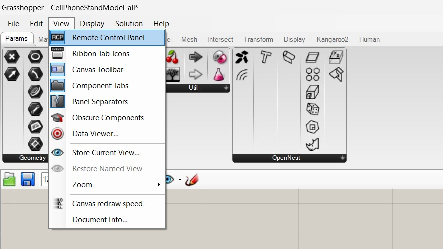

# Fareha Khan, Technology Design Foundation

### Welcome to my GitHub repository! 

Hi! my name is Fareha Khan. I am a Mechanical Engineer by profession and a Designer by heart. Currently, I am based in Dubai working as an Industrial Sustainability Engineer at Schneider Electric. I deeply care about ideas and products that make us feel more humane and connect us with our true selves. I am co-founder of Efert, a non-profit public toilet management system in Karachi, my hometown. In my free time, I love to chat with my grandparents, watch sports with my friends or watch movies with my mom.

I came across a video of James Dyson answering some really fun desing questions and I absolutely love his design thinking. 
[Check it out!](https://www.youtube.com/watch?v=zFCFe38EIfE)

---
# Report 1 - Week of 08/31/2023 (Getting started with Project 1) #
This week, I got introduced to grasshopper and explored some files to design and laser cut a phone stand. So what is Grasshopper? In short, Grasshopper is a visual programming language that runs with Rhinoceros 3D. 

## :memo: Getting Started...

The first step I took to approach this project was to read a little bit about Grasshopper and try to get a sense of what this software is. I found some really helpful information on [Rhino's website](https://www.rhino3d.com/6/new/grasshopper/) It explains how Grasshopper allows a wide range of functions from environmental analysis to robotic control! In addition to that, I also watched Kyle's beginner videos about Rhino. 

Second step for me was to get started with the Phone Stand files that was shared with us in class last week. When I first opened the file, it was a little difficult for me to locate the options and tools. I was successfully able to open the grasshopper file through Rhino, but my screen looked very different from TJ's Rhino screen during class. 
This is what my screen looked like, very blank and no Remote Control

I figured the problem was that my screen was missing the Remote Control Panel which would be used to manipulate the variables. Then after hovering over different tabs and tools, I figured out that the RCP (Remote control panel) was in Grasshopper's window under view!

## :swimmer: Progressing...

After being able to locate the Remote Control Panel, I tried to modify the parameters such as phone dimentions, student height and table dimentions. I noticed that my heigth is shorter than the height of the student in example, so I also tried to change the phone angle in such a way that it would cover me completely.

I also chose to product only 2D drawings as I wanted to work with laser cutting. After I was satisfied with the parameters, I saved changes and checked out the drawing for productions file. The drawings seemed to be what I expected them to be so I exported them to dxf file and went on for laser cutting. 

The material I chose was plywood 1/4 inch board. I set the dxf file for the right document setup such as stroke line: 0.072 pt, RGB 255,0,0 for cut, and, and no fill. The laser cutting process was very satisfying to watch. 

After all the parts were cut, I assembled them to construct the phone stand. The assembled peice looked alright in terms of the cut, shape and size.

However, I noticed that the parts were not fitting perfectly, and the phone stand was not exatly sturdy. I noticed that this was because of the cuts in the base being slightly  larger than the thickness of the material. 

I also realized that this orientation only allowed the phone to be held in landscape which is not very convenient. 

## 📈 Getting There...

I realized that there are a lot of things interconnected in this project and it is easy to get confused. Therefore, I decided to make a flowchart of actions that would help me produce my next phone stand models. The flowchart looked a little bit like this: 

We start by going back to the Grasshopper and Rhino files to change the parameters. Once the parameters are decided, the drawing should be checked to see if it matches expectation. The next step would be to bake the drawing in grasshopper so it can be exported to dxf for laser cutting. Next, the dxf file should be prepared with the right document set up. The laser cutter safety precautions should be checked. The plywood then should be kept at the right place and with focus view it should be checked whether the drawings are within the scope. 

## 🔮 Final Thoughts...

I think grasshopper is an amazing tool that allows excellent design modifications and automation. For next week, I will focus on modifying the phone stand design to allow portrait orientationa and have a more sturdy fit. I also think that with the use of AI and chatgbt in grasshopper, this entire process in the future may be completely automated. 

---
# Report 2 - Week of 09/07/2023 #

## 🏁 Phone Stand Modification

This week, I spent a little more time with the Rhino and grasshopper files relavant to the phone stand. I realized that the grasshopper file allows many modifications in the final shape of the phone stand. Something new I touched was 'prism' modifications. Modifying the prism offset values has an effect on the 'claw' of the phone stand.

I realized that if I could completely remove the claw, the phone stand could also allow portrait orientation. Modifying the prism values looked like this: 

The next part to tackle is to manage the phone stand width. This is important because the width we set, automatically changes the size of mortoise (the joint to fix the phone stand). In the first trial, the phone stand I produced was not sturdy because I did not change the width in grasshopper. This time, I measured the width of plywood that I am going to laser cut for the phone. The phywood measured to be around 2.1 inches (5.3 cm). Accordingly, I set the width in grasshopper to be 5 cm. I imagined that if the width of mortoise is lesser than the width of the tenon, it could be tight fixed. 

## 🥩 Laser Cutting 

After changing the parameters on grasshopper, the final drawing of the phone stand looked like this:

I also decided to engrave something on the phone case to make it customized. I added a text "hello" from Adobe illustrator on the drawing. The important point here was to carefully select the lines of the shape to be red, and make sure the lines of text are blue. This is because for laser cutting, a red line indicates the machine to cut and a blue line indicates vectoring etching or engraving. 

https://github.com/Berkeley-MDes/tdf-fa23-Farehak/assets/143111800/cd6227e2-f745-4c61-ad51-2ac93e693ee1

## 🏗️ Assembly

The final and most interesting part of this trial was the assembly. After all the parts were laser cut, I had to assemble and test if they fit tightly. As expected, the tenons were a little bit big and forcing them into the mortoise was a little difficult. I decided to grab a hammer and softly tap on the pieces to fit exactlt in the joints. 

https://github.com/Berkeley-MDes/tdf-fa23-Farehak/assets/143111800/7d667676-46b5-481d-92e1-7fab5feed465

This step was a little scary as I needed to be careful not to deform the joints. The soft taps and gradual fixes of the axis made sure that the phone stand assembled perfectly. It came out to be very sturdy and compact. The absense of 'claw' not allowed different orientations but also made the phone stand very compact and aestheically pleasing. Here is the comparison of the two models:

## ☑️ Testing

After I assesmbled the phone stand, I placed on top a table with height approximately the same as I set in grasshopper. Then I placed the phone in both landscape and portrait orientation to record a video of me pretending to knit. This step was important for me to understand and test how the parameters such as phone angle, table height, student height, and z focus changed the final quality of filming. This is how the videos turned out to be:

Landscape testing:

https://github.com/Berkeley-MDes/tdf-fa23-Farehak/assets/143111800/15591639-b144-4cef-8a1a-ee23ec7a7a6d

Portrait testing: 

https://github.com/Berkeley-MDes/tdf-fa23-Farehak/assets/143111800/443d6aea-2062-476c-834f-7f0e0776b5df

After reviewing the videos, I was very happy with my work. I changed the phone angle in grasshopper to be less steeper as I know my height is less than the height of the student considered in the example, this means that the phone angle should not focus as high up as it originally was set. 

## 🔮 Final Thoughts...

I think I am happy with the final phone stand model as it is as sturdy as I wanted it to be and it is customized for my height.

---
# Report 3 - Week of 09/14/2023 (Project 1: Computational Design) #

### Porject files: 
[PRoject 1.zip](https://github.com/Berkeley-MDes/tdf-fa23-Farehak/files/12656562/PRoject.1.zip)

## Challenge Level: 02. Platypus
I decided to choose this level for two reasons. First, I am working with
grasshopper for the first time, I have worked with Fusion 360 before but not with
a software close to grasshopper. Second, I planned on going for Axolotl level with
a really cool idea I had about making a purse from flexible plywood. However, I
did not find the time to get all the materials needed for that project, so I decided
to go with another idea I had. In this paper, I will be presenting a fruit bowl that I
designed on grasshopper and build through laser cut. I think this project is a
good example of Platypus level as it includes a lot grasshopper functions and the
final piece is functional and rigid

## The Design

## Challenges

### What to build?
Like a lot of other classmates, I first struggled with deciding
how to start with this project. At first, I started by
practicing grasshopper and building basics shapes. I also
laser cut the phone stand two times with different
modifications. One thing that I really wanted to learn was
how to make hinges with Grasshopper similar to the phone
stand. I did some searching and found out different mesh
or waffle shapes that can be created from grasshopper. My
biggest challenge was to understand how to make a curved
shape that can serve as a bowl.

### How to Start?
I started by watching a few videos about parametric
design. I wanted to make a shape that has repeated
patterns. At first, I started by making simple parametric
shapes, such as repeated rectangles. I then built up and
understood some of the existing tutorials on how to design
parametric shapes.

### 3D Print or Laser Cut?
I wanted to laser cut instead of 3D print. That is because I
am generally very interested in wood working and
assembling. Another upside or downside to laser cutting is
that it requires more design elements. For example, hinges
and placing the shapes in 2D to be able to cut. This is
something I struggled. I was not sure if there was a
functions to turn a rhino 3D model to 2D drawings.

## Process and Results

### Modeling:
In terms of modeling, I started by
drawing a sphere and cylinder. I
achieved the bowl shape using
solid difference. I then added the
ridges by creating a box around the
sphere and using brep to cut
through.

https://github.com/Berkeley-MDes/tdf-fa23-Farehak/assets/143111800/81a5576c-9ccc-4edc-a8b6-4fbbb7f21e35

### Parameters:
The variable parameters that I kept
for this design were, the radius of
the bow, the height of the bowl, the
number of ribs, the thickness of
each rib, and the roundness of the
ribs edges

https://github.com/Berkeley-MDes/tdf-fa23-Farehak/assets/143111800/d6097b94-285d-4cc6-8951-418a1b1f67e3

### Evaluation:
One of the most important things
to take care of was to make sure
the ridges are placed in 2d, ready
to be laser cut. I also checked the
material thickness of the hinges in
the final render to make sure it is
slight smaller than 0.5 cm, which is
the thickness of the plywood used
for laser cut

### Fabrication:
I started by prepping the plywood first. I taped the plywood
on the laser cut bed carefully so it is completey flat. I aligned
all the pieces on the illustrator in a nested form. I also made
sure that all strokes are red color and set to almost 0 pts. I
then cut and placed all the similar pieces together so that it
is easier to assemble

https://github.com/Berkeley-MDes/tdf-fa23-Farehak/assets/143111800/8fc4a5ff-0ff7-4d84-b0ae-67cc1a55f8df

### Testing:
At first, I cut two pieces only and
put them together to check if the
material thickness is right. After
the initial test, I assembled and
placed the bowl on a flat table
top to see if it is stable. I also
tested the bowl by putting
weights in it to check if it still
holds and is rigid. I also fliped the
bowl to check if there were any
loose hinges

## SPECULATIONS

## CONCLUSION
I am really happy with the final design and
prototype of the model. The fruit bowl is very useful
and works as a product that I can use in day to day
life. I am also glad about achieving all this on
grasshopper. This project helped me understand
many things including, design process, parametric
design, and how to learn a new software efficiently. I
also learned from the feedback given in class and
modified the presentation. I made sure the
voiceover was audible

---
# Report 4 - Week of 09/21/2023 #

Week 4 had a slow start as right after finishing the first project, it felt like everyone in the cohort deserved a break. (Which I regret now)

## Getting introduced to Electronics Kits

---
# Report 5 - Week of 09/28/2023 #

---
# Report 6 - Week of 10/05/2023 #

# Report 8 - Week of 10/19/2023 # (Project 2: Digital Ecosystem)

## Challenge Level: 03. Axolotl

I decided to choose this level because I aimed to create something different and unique. The idea of diving into machine learning is something completely to me and so it made sense to go for axolotl level. Even though I did not achieve everything I wanted to in this project, I still have given it a lot of time and produced something unique. I also felt that I have been very dedicated to the idea of this project and took on a lot of tasks and that’s why I choose this level.

## Challenges (Individual)
### What is my aim?
Pets’ activities are an important indicator to their health. A low or high level of activity may be associated with a disease that the pet might be suffering from. It is important for pet owners to monitor their pet’s activity and be alert if a change is observed. The observation could be made more accurate and easily detected through an automated monitoring system. With this idea in mind, my aim was to design a system that stores pet’s movements and recognizes a change in pattern. For the system to be able to recognize a change, it needs to be able to read the data and categorize it into different categories of activities. We have systems that recognize movements and activity of humans. However, a pet’s activities can be very different and require a new set of database to begin with.

### Which sensor to use?
I started by experimenting and testing the proximity sensor. However, I quickly realized that the proximity sensor only detects presence of nearby objects. In our project it would not help much. Then I started researching and experimenting with an accelerometer to incorporate in our project. Accelerometers help detect changes in speed and orientation that can be associated with the activity. An advantage of using accelerometer is that it can easily be mounted on the pet as part of a wearable and collect data in real time using a data logger. Using a combination of datalogger, battery, photon, and accelerometer we could design a data storage system.

### How to recognize activity?
Finding the system to store the data is one challenge, but to understand the different types of activities requires machine learning. In order to recognize and categorize the stored data I explored edge impulse. Edge impulse is a platform that allows machine learning applications to deploy projects that require training and testing of data. One of the main challenge was to connect the photon with edge impulse. Edge impulse requires the user to store data or collect live data while designing a project. However, connecting the photon device directly with Edge impulse was a tedious process. After trying different ways, I understood that my computer did not have a specific cygwin that would allow the photon to connect directly with Edge impulse. Therefore, I decided to store data through a data logger and use that data to train the model. I also had to try different sets of code to make the system work. After several trials and TJ’s help I was able to write the correct code that I was able to flash and store values. 

### What will the wearable be?
As we progressed with the project, it became clear that our wearable needed to be a box similar to an apple watch. This tiny box would enclose the battery, photon and accelerometer. The box would then be tied on a ‘dog collar’ which ensures the accelerometer is always placed at the back of the pet. In case of a dog for example, the accurate movement readings are collected when an accelerometer is placed on the back. I designed a cad drawing of the box with space for a belt to pass through. This belt would be the ‘collar’. This file was used to 3D print the box.

## Process and Results (Individual)
### Four types of Activities
the main photon has a 3 axis accelerometer that collects the pets data continuously through a data logger. This data is then uploaded in edgeimpulse and classified into 4 labels: the edgeimpulse helps create a library that can be used later for monitoring through coding. Through this library the owner gets to monitor pet’s activity. The 4 types of activities we labeled for now are sitting, jumping, slow walking, and rolling. The type of activities the pet is doing more throughout the day, can be connected to their health. For simplicity, these activities can be considered the main activities a pet would involve in. Sitting for longer periods of time can indicate that something is different with the pet’s health. We also added rolling in the database because excessive rolling can be a reaction to some underlying health conditions. 

https://github.com/Berkeley-MDes/tdf-fa23-Farehak/assets/143111800/257f75d5-337d-4610-bb6d-e632549e9416

### Data collection & Training
After several trials of collecting data and training, I was able to deploy a system that could successfully recognize the 4 motions. I also tested the system several times and checked for errors. In the end, I was able to categorize the dataset into 4 different types. As shown in the graph below, we can see that for the 4 types of activity, the data points are very far apart. This shows that the margin of error is less while recognizing the motions.

## Reflections
I will try to reflect on the different steps and aspects of the project through a meter. If I fell the step was successful, the meter would point towards far right. 

## Speculations

While working on this project I realized that this idea could be developed in different ways. First of all, I think the most obvious way forward would be to create an app that would easily show the activity of the pet. Second, with the merge of AI, the activity level of different types of pet could be categorized automatically. AI has the power to read different types of data and interpret it. If the step of humans inputting data and categorizing it manually could be eliminated, we could probably get a more accurate system. AI could possibly accurately decide what level is high or low based on the data collected over time from pet’s movements. The same could be said about the heartbeat sensor. The heartbeat sensor and accelerometer could both be controlled by AI.  

# Report 10 - Week of 11/02/2023 # (Project 3: MiniMe)

# Report 9 - Week of 10/26/2023 # 
